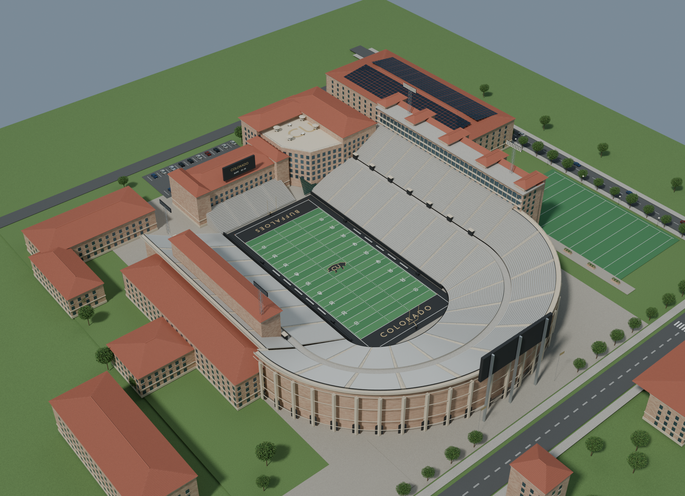

# Folsom Play Lab

A local 3D football simulator set in a procedural recreation of Folsom Field in Boulder, Colorado. Choose a play and defensive coverage, snap the ball, switch cameras, and inspect routes and live charts.



*Blender rendering of the stadium architecture. The interactive app adds players, instanced fans, and play controls.*

## Run on Windows

1. Download **Folsom-Play-Lab-Windows-x64.zip** from the [latest release](https://github.com/AntoniCzolgowski/folsom-play-lab/releases/latest).
2. Extract the entire ZIP to a folder.
3. Double-click **Folsom Play Lab.exe**.

Keep the extracted folder together. A Node.js runtime is included; Blender, a development environment, and an internet connection are not required. Chrome or Edge opens the simulator in an app window, with the default browser as a fallback. The launcher is an unsigned Windows executable.

The app serves only on `127.0.0.1:5187`. The server exits a few minutes after the app closes. There are no accounts or external API calls.

## Features

- Eight plays: Mesh Cross, Inside Zone, Slant/Flat, Four Verticals, Levels Dig, Boot Flood, Power Right, and RB Slip Screen.
- Cover 1, Cover 2, and Cover 3 defensive behavior; 11 players per side.
- Colorado black jerseys with gold helmets and pants; a generic white-and-blue visiting team.
- Broadcast, sky, end zone, quarterback, ball carrier, and stadium orbit cameras.
- Colored routes, coverage overlays, receiver separation and ball-progress charts, replay scrubbing, and playback speed controls.
- Instanced crowds and adjustable quality with adaptive rendering resolution.

**Controls:** Space plays or pauses; R resets. Drag to orbit and scroll to zoom. Camera input temporarily overrides camera following.

## Development

Use Node.js 22.13 or newer and pnpm. Dependencies are pinned in `pnpm-lock.yaml`.

```sh
pnpm install --frozen-lockfile
pnpm dev
```

Open the local address printed by the development server. Main files:

| File | Purpose |
| --- | --- |
| `app/page.tsx` | Play selection, replay controls, charts, and app layout |
| `lib/simulation.ts` | Deterministic football simulation |
| `lib/stadium-viewer.ts` | Three.js stadium, players, crowds, and cameras |
| `public/stadium.glb` | Optimized stadium model |
| `FolsomLauncher.cs` | Windows launcher |
| `launcher-server.cjs` | Loopback static server for the portable app |

```sh
pnpm exec tsc --noEmit
node --experimental-strip-types lib/simulation.test.ts
pnpm build
```

The production static export is generated in `dist/client`. See [BUILD-NOTES.txt](BUILD-NOTES.txt) for the verified checks and a known Windows Vinext/libuv shutdown assertion: compilation and prerendering complete, but the CLI may exit unsuccessfully during shutdown. The packaged export was independently served and tested. The distributed server does not exhibit that shutdown issue.

To package a fresh, successfully generated and checked static export on Windows:

```powershell
.\scripts\package-windows.ps1
```

The packaging script uses the installed `node.exe` and Windows .NET Framework compiler. It copies Node's license from the installed distribution when available; otherwise it fetches the license for that exact Node version from the official Node.js repository. The portable output is written to `release/Folsom_Play_Lab`. The script does not run or conceal build failures.

## Model and simulation scope

The stadium is an original procedural visual approximation inspired by Google Earth aerial and oblique views, CU Athletics stadium information, and Populous's Champions Center project. No Google Earth imagery is embedded. Architectural dimensions beyond the regulation field are visual estimates. The optimized model contains 24 mesh groups and approximately 149,000 vertices.

Plays use simplified rules for routes, accelerated movement, coverage, blocking, quarterback reads, lead throws, catches, pursuit, tackles, and boundaries. This is an educational simulator, not a prediction engine or a full contact-physics game, and it does not represent the actual Colorado roster. This project is unofficial and is not affiliated with the University of Colorado.

Balanced broadcast performance measured approximately 45–50 FPS on the development computer. Performance depends on hardware, camera, window size, and other applications. Crowd bodies and heads each use a single instanced batch; reduced quality lowers density and resolution.

## References and dependencies

- [Google Earth: Folsom Field](https://earth.google.com/web/search/Folsom+Field,+Boulder,+Colorado)
- [CU Athletics stadium information](https://cubuffs.com/documents/download/2022/6/14/folsom_information_map.pdf)
- [Populous: University of Colorado Champions Center](https://populous.com/projects/university-of-colorado-champions-center)
- [USA Football route concepts](https://blogs.usafootball.com/blog/730/rcfamilies.com)
- [USA Football coaching reference](https://blogs.usafootball.com/blog/590/rcfamilies.com)

Built with React, TypeScript, Three.js, Vinext, Tailwind, and Shadcn/Base UI controls. See [THIRD_PARTY_LICENSES.txt](THIRD_PARTY_LICENSES.txt) for third-party notices. The Windows download also includes Node.js's license.
